# 🚀 GitOps Task Manager

<div align="center">


**A production-grade full-stack Task Manager application built to demonstrate end-to-end DevOps engineering skills.**

*From source code to live AWS deployment — fully automated with GitOps, CI/CD, IaC, and Monitoring.*

</div>

---

## 📋 Table of Contents

- [Overview](#-overview)
- [Architecture Diagram](#-architecture-diagram)
- [Request Flow](#-request-flow)
- [Tech Stack](#-tech-stack)
- [Application Features](#-application-features)
- [Project Phases](#-project-phases)
- [Screenshots](#-screenshots)
- [Quick Start](#-quick-start)
- [How GitOps Works](#-how-gitops-works)
- [CI/CD Pipeline](#-cicd-pipeline)
- [Monitoring](#-monitoring)
- [Infrastructure](#-infrastructure)
- [Repository Structure](#-repository-structure)
- [Author](#-author)

---

## 🎯 Overview

GitOps Task Manager is a **production-grade portfolio project** that demonstrates a complete DevOps engineering workflow. It is a full-stack task management application deployed on **AWS EKS** using a fully automated pipeline — from a developer pushing code to the app being live on the internet, everything is automated.

**What makes this project special:**
- 🔄 **True GitOps** — Git is the single source of truth. Push code → ArgoCD auto-deploys
- ⚡ **One-command deploy** — `bash scripts/deploy.sh` provisions infrastructure and deploys everything
- 🔒 **Security scanning** — Every Docker image scanned with Trivy before deployment
- 📊 **Production monitoring** — Prometheus + Grafana with custom dashboards
- 🏗️ **Real cloud infrastructure** — AWS EKS, EBS, VPC, ELB — all provisioned with Terraform

---

## 🏗️ Architecture Diagram

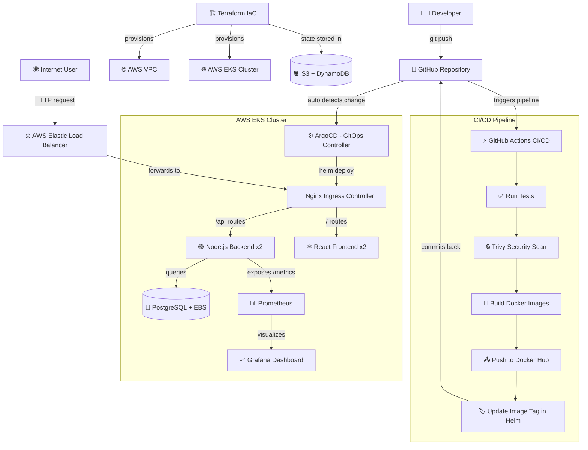

---

## 🔀 Request Flow

```
🌍 Internet User
       │
       │  HTTP Request
       ▼
┌─────────────────────┐
│   AWS Elastic       │  ← Auto-provisioned by Kubernetes
│   Load Balancer     │    when Nginx Ingress is deployed
└─────────────────────┘
       │
       │ forwards traffic
       ▼
┌─────────────────────┐
│   Nginx Ingress     │  ← Routes based on URL path
│   Controller        │
└─────────────────────┘
       │
       ├──── /api/* ──────────────────────────────────┐
       │                                              ▼
       │                                   ┌──────────────────┐
       │                                   │  Node.js Backend │
       │                                   │  (2 replicas)    │
       │                                   │  Port: 5000      │
       │                                   └──────────────────┘
       │                                              │
       │                                              │ SQL queries
       │                                              ▼
       │                                   ┌──────────────────┐
       │                                   │   PostgreSQL DB  │
       │                                   │   AWS EBS Volume │
       │                                   │   (persistent)   │
       │                                   └──────────────────┘
       │
       └──── /* ──────────────────────────────────────┐
                                                      ▼
                                           ┌──────────────────┐
                                           │  React Frontend  │
                                           │  (2 replicas)    │
                                           │  Port: 80        │
                                           └──────────────────┘
```

---

## 🛠️ Tech Stack

| Category | Technology | Purpose |
|---|---|---|
| **Frontend** | React + Vite | UI with JWT auth, task management |
| **Backend** | Node.js + Express | REST API with JWT authentication |
| **Database** | PostgreSQL | Persistent data storage |
| **Containerization** | Docker | Multi-stage builds, non-root users |
| **Orchestration** | Kubernetes (EKS) | Container orchestration on AWS |
| **Package Manager** | Helm | Kubernetes application packaging |
| **GitOps** | ArgoCD | Auto-deploy from GitHub |
| **CI/CD** | GitHub Actions | 4-job automated pipeline |
| **Security** | Trivy | Docker image vulnerability scanning |
| **IaC** | Terraform | AWS infrastructure provisioning |
| **Cloud** | AWS EKS + EBS + VPC + ELB | Production cloud infrastructure |
| **Monitoring** | Prometheus + prom-client | Metrics collection |
| **Dashboards** | Grafana | Metrics visualization |
| **Registry** | Docker Hub | Docker image storage |
| **State Management** | S3 + DynamoDB | Terraform remote state |

---

## ✨ Application Features

**Backend (Node.js + Express + PostgreSQL):**
- JWT Authentication (Register, Login, Protected routes)
- Full CRUD for Tasks (Create, Read, Update, Delete)
- Task Categories management
- Input validation and error handling
- Health check endpoint (`/health`)
- Prometheus metrics endpoint (`/metrics`)

**Frontend (React + Vite):**
- Login and Registration pages
- Dashboard with task management
- Filter by priority, category, status
- Search with debounce
- Axios with JWT auto-attach interceptor
- Responsive design

---

## 📦 Project Phases

| Phase | What Was Built | Status |
|---|---|---|
| **Phase 0** | Source code — Node.js backend + React frontend | ✅ Complete |
| **Phase 1** | Dockerfiles — multi-stage builds, non-root users | ✅ Complete |
| **Phase 2** | Docker Compose — full local stack | ✅ Complete |
| **Phase 3** | Kubernetes manifests — 13+ YAML files | ✅ Complete |
| **Phase 4** | Local kind cluster + Nginx Ingress | ✅ Complete |
| **Phase 5** | ArgoCD GitOps — connected to GitHub | ✅ Complete |
| **Phase 6** | GitHub Actions — 4-job CI/CD pipeline | ✅ Complete |
| **Phase 7** | Helm Chart — 18 templates, values-based config | ✅ Complete |
| **Phase 8** | Prometheus + Grafana — custom metrics dashboard | ✅ Complete |
| **Phase 9** | Terraform + AWS EKS — production deployment | ✅ Complete |
| **Phase 10** | ArgoCD + Prometheus + Grafana on EKS | ✅ Complete |
| **Phase 11** | README + Portfolio Polish | ✅ Complete |

> 📖 See [docs/phases.md](docs/phases.md) for detailed breakdown of every phase including bugs fixed and key learnings.

---

## 📸 Screenshots

### 🖥️ Application — Live on AWS EKS

| Login Page | Empty Dashboard |
|---|---|
| 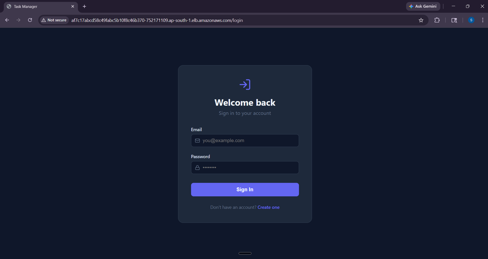 | 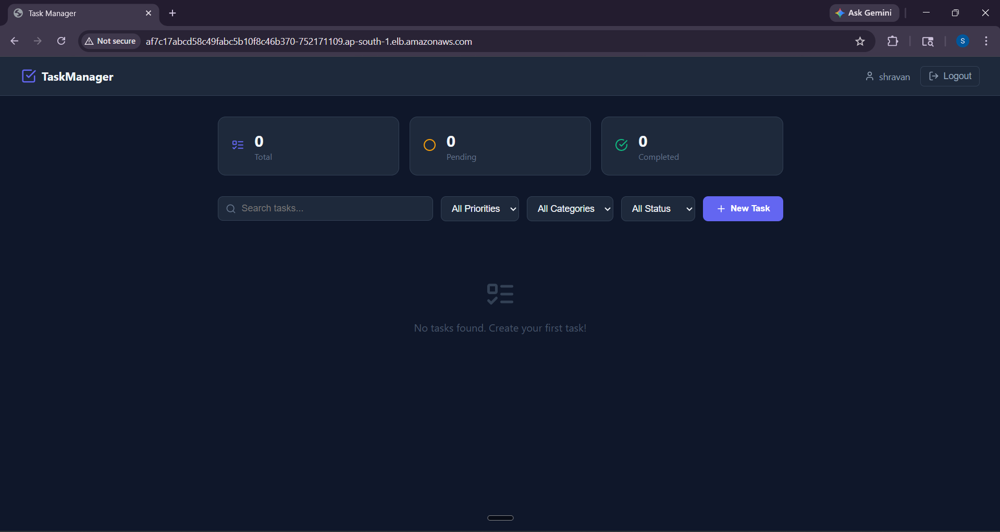 |

| Dashboard with Task Created | Task Marked as Completed |
|---|---|
| 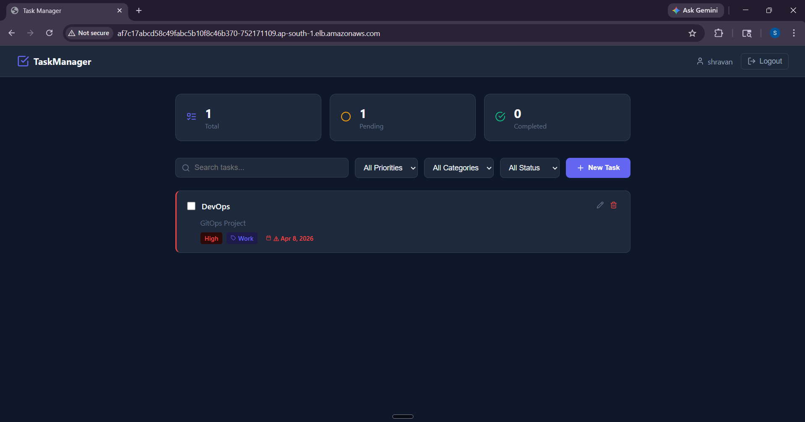 | 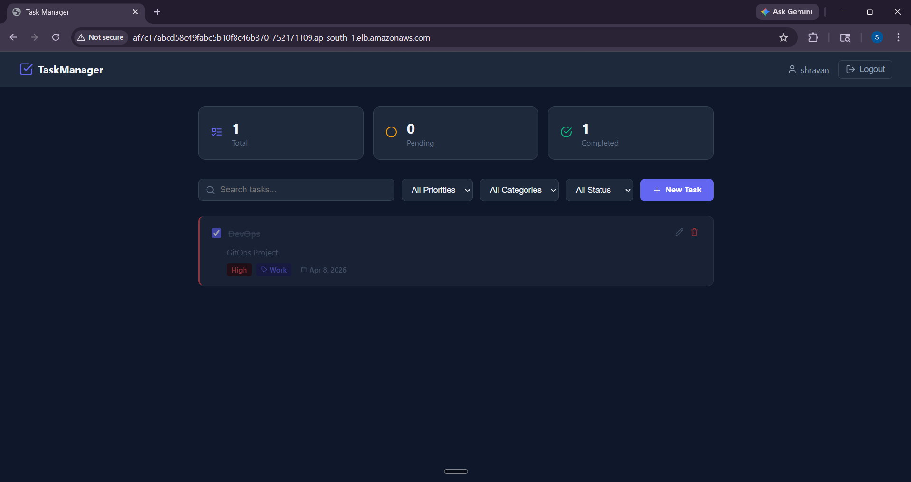 |

---

### ⚙️ ArgoCD — GitOps in Action

| Application Home — Healthy & Synced | Resource Tree View |
|---|---|
| 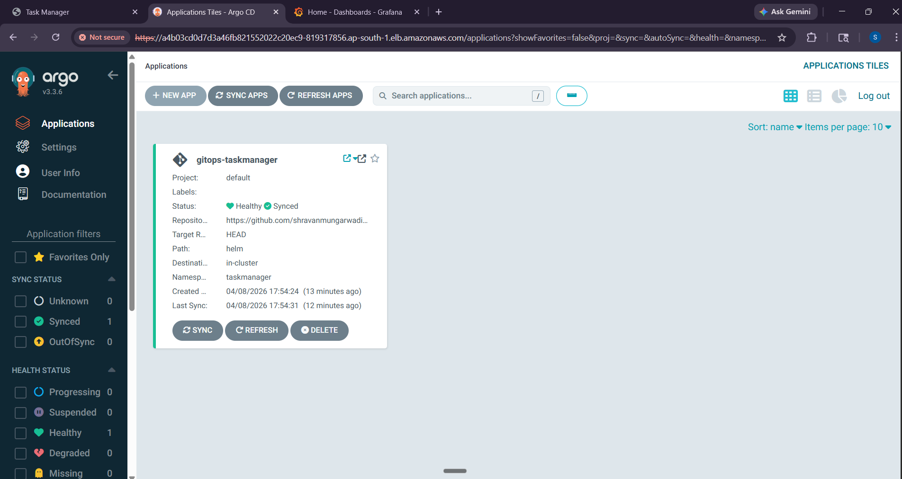 | 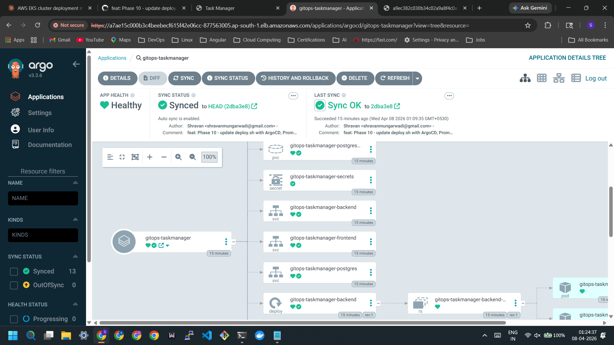 |

| Network View — ELB → Ingress → Services → Pods | Resource List — 13 Resources Synced |
|---|---|
| 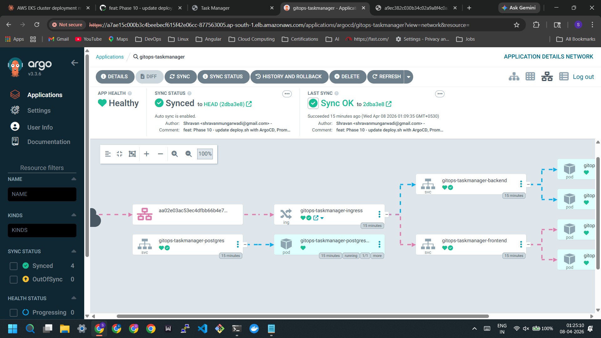 | 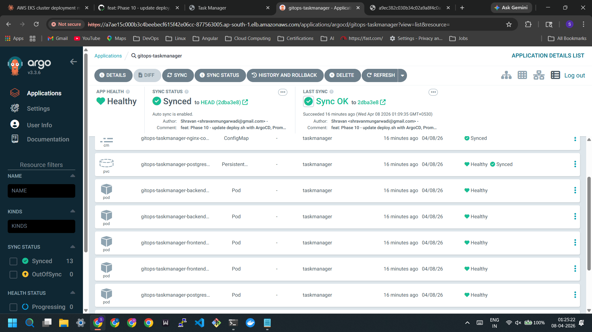 |

| EKS Worker Nodes | Pods Grouped by Node |
|---|---|
| 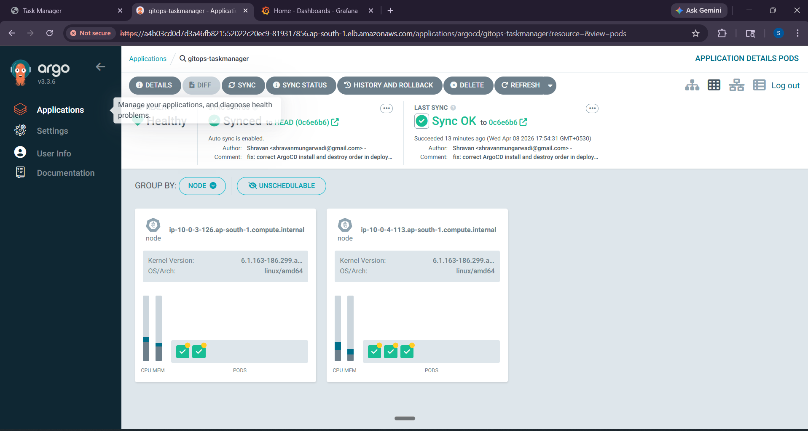 | 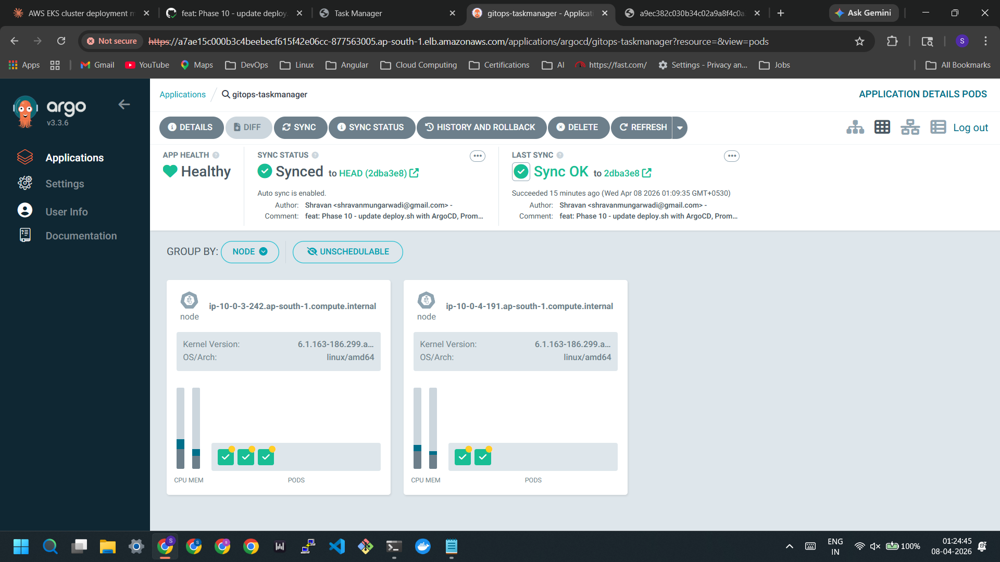 |

---

### ⚡ CI/CD Pipeline — GitHub Actions

| 4-Job Pipeline — All Green |
|---|
| 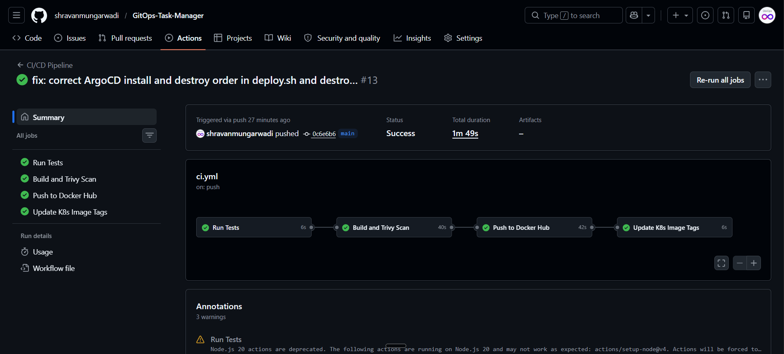 |

---

### 📊 Monitoring — Grafana on AWS EKS

| All Available Dashboards | Custom GitOps Task Manager Dashboard |
|---|---|
| 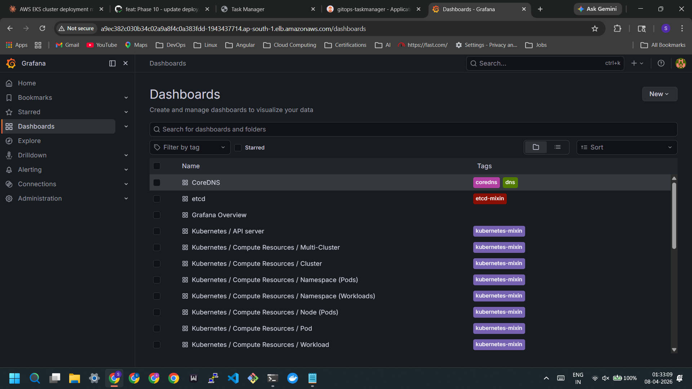 | 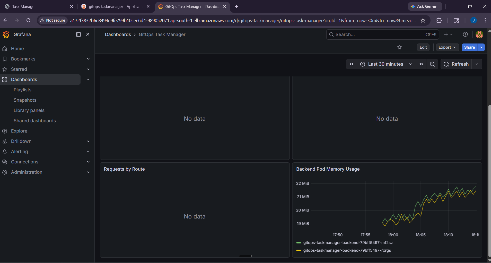 |

| Kubernetes API Server — 100% Availability | Multi-Cluster CPU & Memory Utilization |
|---|---|
| 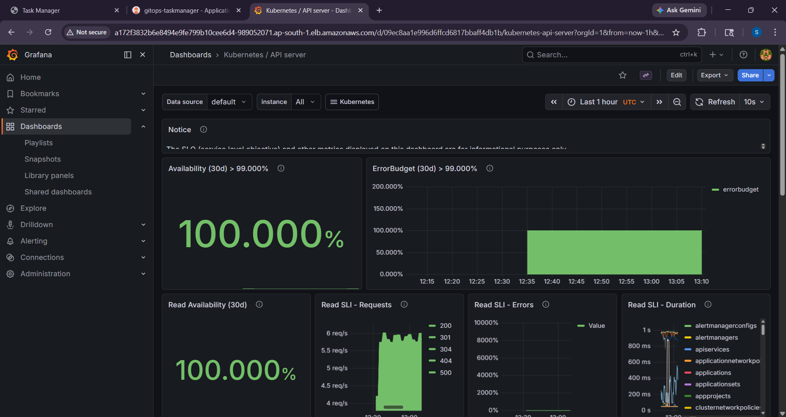 | 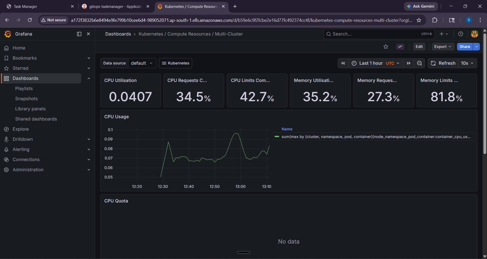 |

| Pod Network Bandwidth | Backend Pod Memory Usage |
|---|---|
| 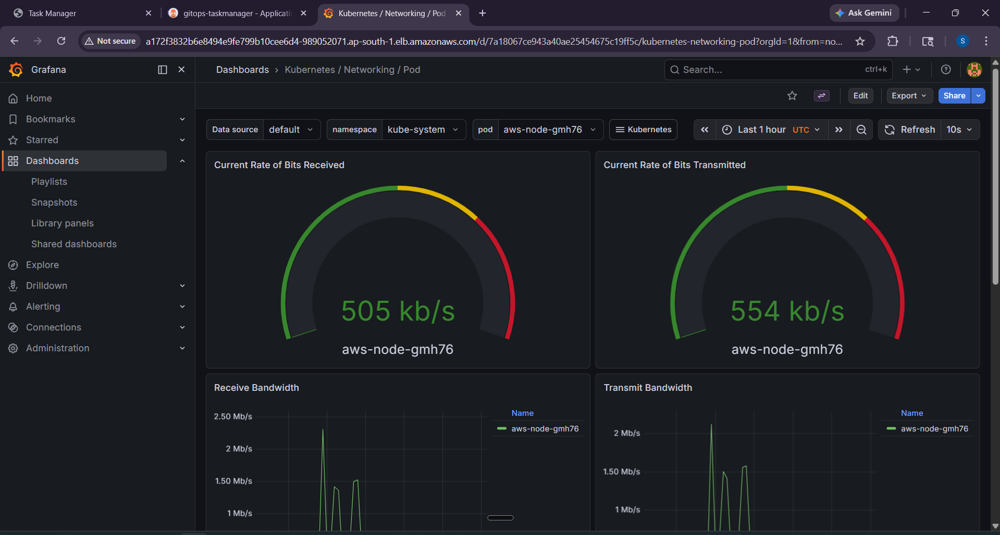 | 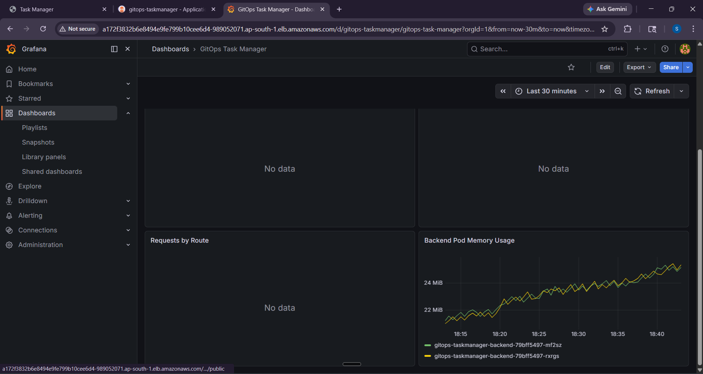 |

---

### 🏗️ Live Infrastructure — All Pods Running on AWS EKS

| All Namespaces — taskmanager + argocd + monitoring |
|---|
| 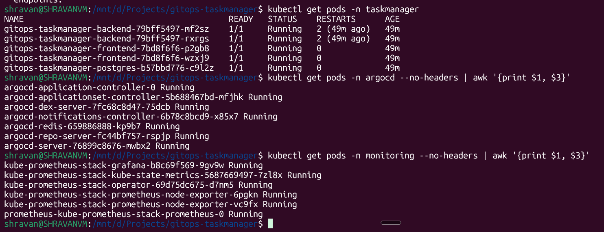 |

---

## 🚀 Quick Start

### Prerequisites
- AWS CLI configured (`aws configure`)
- Terraform installed (`>= 1.0`)
- kubectl installed
- Helm installed
- Docker installed

### One-Command Deploy

```bash
# Clone the repository
git clone https://github.com/shravanmungarwadi/GitOps-Task-Manager.git
cd GitOps-Task-Manager

# Deploy everything — infrastructure + app + monitoring
bash scripts/deploy.sh
```

This single command does everything:
1. Provisions AWS infrastructure with Terraform (VPC, EKS, nodes) — ~15 mins
2. Connects kubectl to EKS
3. Installs Nginx Ingress Controller → AWS ELB provisioned automatically
4. Installs ArgoCD + connects to this GitHub repo
5. ArgoCD deploys the app automatically via Helm
6. Installs Prometheus + Grafana with LoadBalancer
7. Prints all URLs and passwords

### One-Command Destroy

```bash
bash scripts/destroy.sh
```

Tears everything down in the correct order — no manual steps, no VPC dependency errors.

> 📖 See [docs/how-to-run.md](docs/how-to-run.md) for complete step-by-step explanation of both scripts.

---

## 🔄 How GitOps Works

GitOps means **Git is the single source of truth** for your infrastructure and application state.

```
Developer pushes code
        │
        ▼
GitHub Actions runs CI/CD pipeline
        │
        ├── Tests pass ✅
        ├── Trivy scan passes ✅
        ├── Docker image built and pushed to Docker Hub ✅
        └── Image tag updated in helm/values.yaml ✅
                │
                ▼
        ArgoCD detects new commit in GitHub repo
                │
                ▼
        ArgoCD runs Helm internally
                │
                ▼
        Kubernetes rolling update on EKS
                │
                ▼
        Zero downtime deployment ✅
        Zero manual intervention ✅
```

**Key GitOps principles applied:**
- Git is the only way to change what runs in production
- ArgoCD continuously reconciles desired state (GitHub) with actual state (EKS)
- `selfHeal: true` — if someone manually changes a pod, ArgoCD reverts it
- Full audit trail — every deployment is a Git commit with author and timestamp

---

## ⚡ CI/CD Pipeline

The GitHub Actions pipeline has **4 jobs** that run on every push to main:

```
┌──────────┬──────────┬──────────────┬────────────────────┐
│  Job 1   │  Job 2   │    Job 3     │       Job 4        │
│          │          │              │                    │
│   Run    │  Trivy   │    Build     │   Update Image     │
│  Tests   │  Scan    │   & Push     │   Tag in Helm      │
│          │          │  Docker Hub  │   values.yaml      │
│    ✅    │    ✅    │      ✅      │        ✅          │
└──────────┴──────────┴──────────────┴────────────────────┘
```

- **Job 1** — Runs backend test suite
- **Job 2** — Trivy scans Docker image for CVEs
- **Job 3** — Builds multi-stage images, pushes to Docker Hub tagged with Git SHA
- **Job 4** — Updates `helm/values.yaml` with new SHA tag, commits back → ArgoCD deploys

---

## 📊 Monitoring

### Prometheus Metrics
The Node.js backend exposes custom metrics at `/metrics` using `prom-client`:

| Metric | Type | Description |
|---|---|---|
| `http_requests_total` | Counter | Total HTTP requests by method/route/status |
| `http_request_duration_seconds` | Histogram | Request latency distribution |
| `active_connections` | Gauge | Current active HTTP connections |

### Grafana Dashboards
- **Kubernetes / Compute Resources / Cluster** — EKS CPU, memory, network
- **Kubernetes / API Server** — 100% availability SLO tracking
- **Kubernetes / Networking / Pod** — Pod network bandwidth
- **GitOps Task Manager** — Custom app dashboard with HTTP metrics

---

## 🏗️ Infrastructure

All AWS infrastructure is provisioned with Terraform — 26 resources total:

```
infra/terraform/
├── backend.tf      # Remote state → S3 + DynamoDB locking
├── variables.tf    # All configurable values
├── main.tf         # AWS provider + availability zones
├── vpc.tf          # VPC, subnets, IGW, NAT Gateway, route tables
├── eks.tf          # EKS cluster, node group, IAM roles, EBS CSI Driver addon
└── outputs.tf      # Cluster endpoint, kubeconfig command
```

**Remote State:**
- S3 Bucket: `gitops-taskmanager-tfstate`
- DynamoDB Table: `gitops-taskmanager-tflock`

**Running Cost:** ~$0.32/hour | **When destroyed:** ~$0.00/hour

---

## 🗂️ Repository Structure

```
gitops-taskmanager/
├── backend/                    # Node.js + Express API
│   ├── src/
│   │   ├── config/             # App configuration
│   │   ├── db/                 # PostgreSQL connection pool
│   │   ├── middleware/         # Auth + error handling
│   │   └── routes/             # auth.js + tasks.js
│   └── Dockerfile              # Multi-stage, non-root user
├── frontend/                   # React + Vite
│   ├── src/
│   │   ├── api/                # Axios with JWT interceptor
│   │   ├── components/         # Navbar, TaskCard, TaskForm
│   │   └── pages/              # Login, Register, Dashboard
│   ├── nginx.conf              # Production nginx config
│   └── Dockerfile              # Multi-stage, nginx serve
├── helm/                       # Helm chart (18 templates)
│   ├── Chart.yaml
│   ├── values.yaml
│   └── templates/
├── infra/terraform/            # AWS infrastructure (6 files)
├── monitoring/                 # Prometheus + Grafana
│   ├── prometheus-values.yml
│   ├── backend-servicemonitor.yml
│   └── grafana-dashboard.json
├── scripts/
│   ├── deploy.sh               # One-command full deployment
│   └── destroy.sh              # One-command full teardown
├── docs/
│   ├── architecture.md         # Deep dive architecture
│   ├── phases.md               # All 11 phases + bugs + learnings
│   ├── how-to-run.md           # deploy.sh + destroy.sh explained
│   ├── setup-guide.md          # Prerequisites + AWS setup
│   └── screenshots/            # All project screenshots
├── .github/workflows/
│   └── ci.yml                  # 4-job GitHub Actions pipeline
└── docker-compose.yml          # Local development stack
```

---

## 👨‍💻 Author

<div align="center">

**Shravan Mungarwadi**

*Aspiring DevOps Engineer*

[](https://www.linkedin.com/in/shravan-mungarwadi-569ab7215/)
[](https://github.com/shravanmungarwadi)
[](https://hub.docker.com/u/shravanvm)

</div>

---

<div align="center">

### 📚 Documentation

| Document | Description |
|---|---|
| [Architecture](docs/architecture.md) | Deep dive into every component and design decision |
| [All Phases](docs/phases.md) | 11 phases with bugs encountered and key learnings |
| [How to Run](docs/how-to-run.md) | Complete deploy.sh + destroy.sh flow explained |
| [Setup Guide](docs/setup-guide.md) | Prerequisites + AWS one-time setup |

---

*Built with ❤️ to demonstrate production-grade DevOps engineering skills*

**⭐ Star this repo if you found it helpful!**

</div>
