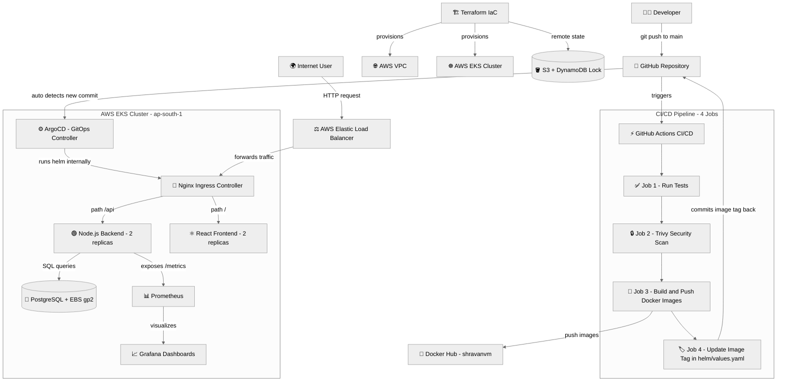
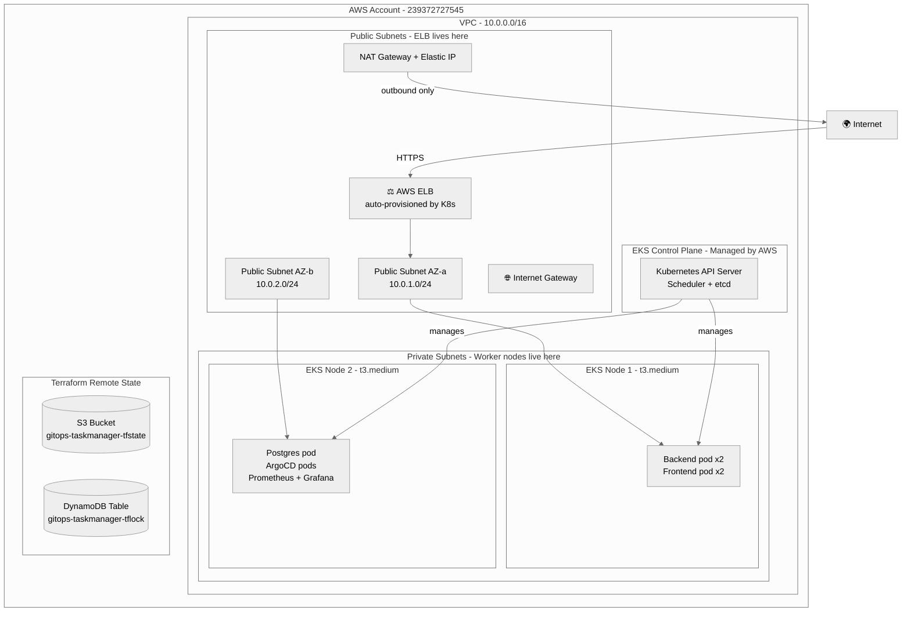
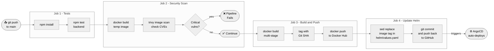
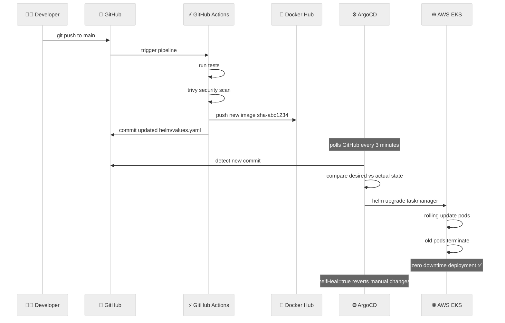
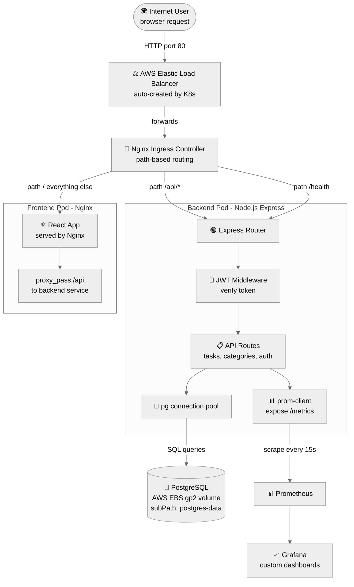
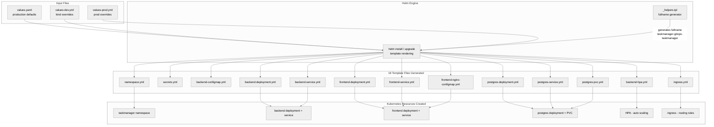
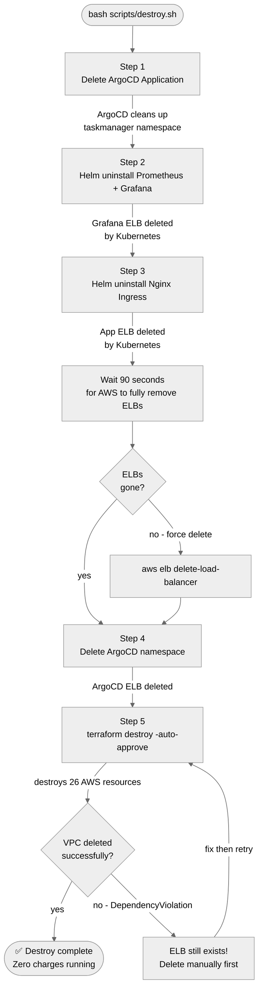
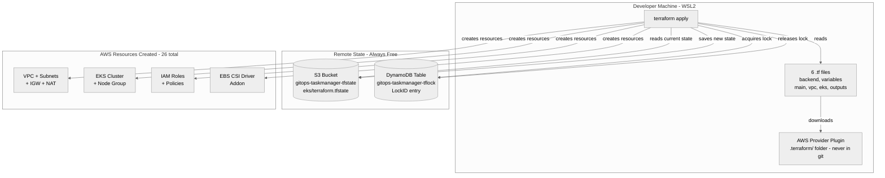
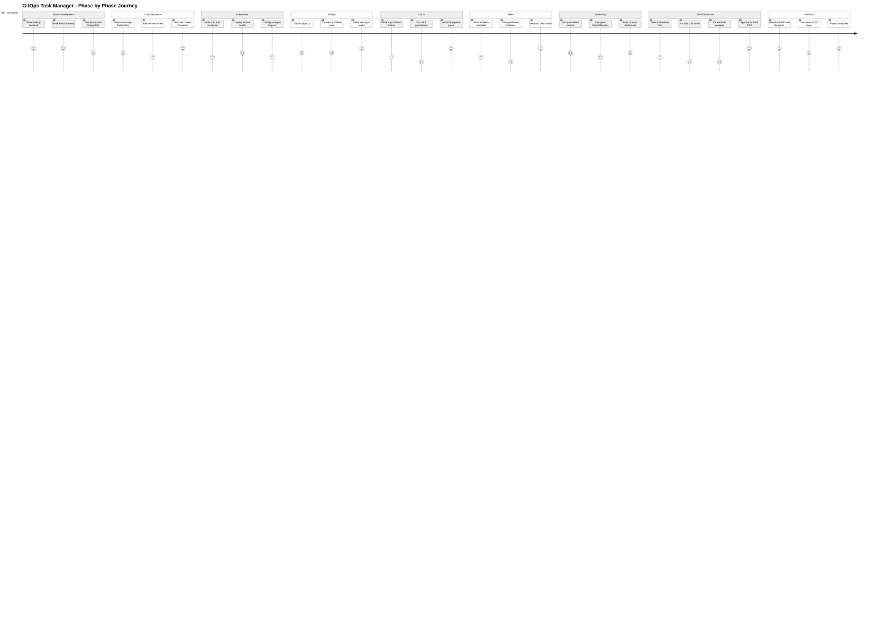

# 📊 Project Diagrams

All architecture and flow diagrams for GitOps Task Manager.

---

## 1. Complete GitOps Pipeline Flow



---

## 2. AWS Infrastructure Layout



---

## 3. CI/CD Pipeline - Detailed Job Breakdown



---

## 4. ArgoCD GitOps Sync Loop



---

## 5. Request Journey — User to Database



---

## 6. Helm Chart Structure and Value Flow



---

## 7. Monitoring Architecture

```mermaid
%%{init: {'theme': 'neutral'}}%%
graph LR
    subgraph Node.js Backend
        Code[Express routes] -->|every request| PC[prom-client]
        PC -->|Counter| M1[http_requests_total]
        PC -->|Histogram| M2[http_request_duration_seconds]
        PC -->|Gauge| M3[active_connections]
        M1 & M2 & M3 --> EP[/metrics endpoint]
    end

    subgraph Kubernetes
        SM[ServiceMonitor\nbackend-servicemonitor.yml] -->|selector:\napp.kubernetes.io/component: backend| SVC[backend Service]
        SVC --> EP
    end

    subgraph Monitoring Namespace
        PROM[📊 Prometheus\nkube-prometheus-stack] -->|scrape every 15s| SM
        PROM -->|stores time-series| TSDB[(TSDB\nTime Series DB)]
        TSDB -->|PromQL queries| GR[📈 Grafana]
    end

    subgraph Grafana Dashboards
        GR --> D1[Kubernetes / Compute Resources\nCPU + Memory]
        GR --> D2[Kubernetes / API Server\n100% availability SLO]
        GR --> D3[Kubernetes / Networking\nbandwidth metrics]
        GR --> D4[GitOps Task Manager\ncustom app dashboard]
    end

    ELB_G[⚖️ AWS ELB\nGrafana LoadBalancer] --> GR
    Browser[🌍 Browser] --> ELB_G
```

---

## 8. Destroy Sequence — Why Order Matters



---

## 9. Terraform State Management



---

## 10. Phase Journey — 0 to Production


